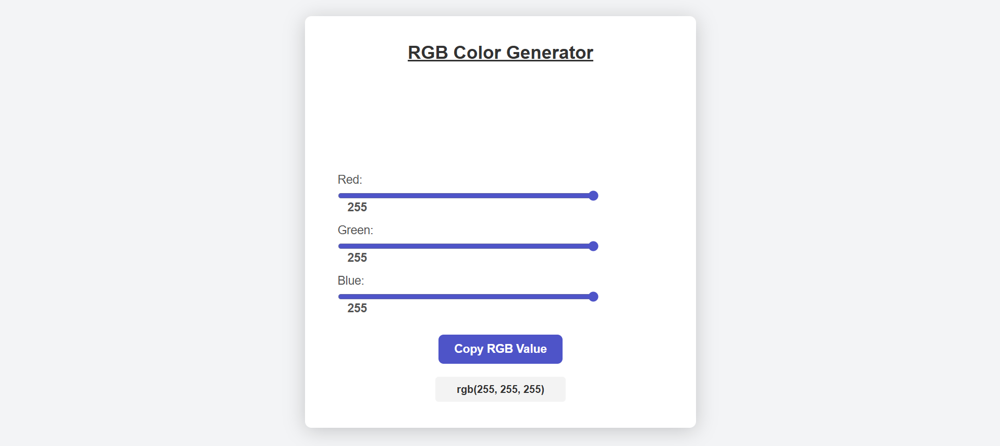

# RGB Color Generator

**Having trouble choosing the right color?** Here's the solution: Adjust each RGB slider carefully while monitoring the real-time color preview. This will help you see how each color component (Red, Green, Blue) affects the final result. The real-time preview makes it easier to experiment and find the perfect color shade.

## Description 

The **RGB Color Generator** is an interactive web application that allows users to generate any color by adjusting the Red, Green, and Blue (RGB) values using sliders. As the sliders are moved, the selected color is displayed in real-time. This simple tool makes it easy for designers, developers, or anyone interested in color creation to explore different shades.

## Preview

Here is a preview of the RGB Color Generator in action:

## Features

- **Interactive RGB Sliders**: Adjust the Red, Green, and Blue values from 0 to 255 to create a wide range of colors.
- **Real-Time Color Preview**: As you adjust the sliders, the background color of a preview box changes instantly to reflect your selected color.
- **Responsive Design**: The layout automatically adjusts for mobile and desktop devices, ensuring the app looks great on all screen sizes.
- **Easy-to-Use Interface**: User-friendly and intuitive design, making it easy for anyone to generate custom colors without needing technical knowledge.
- **Adjustable Precision**: Fine-tune the RGB values with increased precision for detailed color creation.
- **Color Code Display**: View the exact RGB code of your selected color and copy it for your design projects.

## How to Use

1. **Adjust RGB Sliders**:
   - Move the sliders to adjust the intensity of Red, Green, and Blue.
   - Each slider ranges from 0 to 255, where 0 represents no intensity (black) and 255 represents full intensity.
   
2. **View Color Preview**:
   - As you adjust the sliders, the color box below the sliders will instantly update to show the color that corresponds to your current RGB values.
   
3. **Fine-Tune Colors**:
   - If you want a more subtle color change, fine-tune the sliders by adjusting them slightly in small increments.
   
4. **Copy Color Code**:
   - Below the color preview, the exact RGB code (e.g., rgb(255, 0, 0) for red) will be displayed.
   - You can easily copy this code for use in your web design or app development projects.

## Built With

- **HTML/CSS**: For the structure and styling of the page.
- **JavaScript**: For the interactive functionality of the RGB sliders and real-time color preview.
- **Flexbox Layout**: Ensures the page is responsive and adapts to different screen sizes.
- **Local Storage**: To save favorite color selections and access them later.

## Contributing

If you’d like to contribute to this project, feel free to fork the repository and create pull requests for new features or improvements.

---

**Thank you for checking out the RGB Color Generator!** Feel free to experiment with different color combinations and make this tool your go-to color selection guide. If you have any suggestions for improvements, don't hesitate to reach out!
